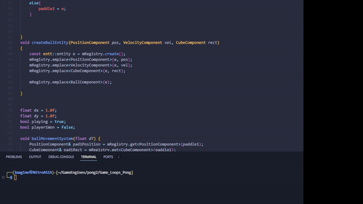

# Engine Scripting Lab: Pong

## Objetivo del Proyecto
Este proyecto tiene como objetivo practicar el uso de lenguajes de scripting para ampliar y personalizar las funcionalidades de un motor de juegos. Se ha elegido implementar una versión del juego clásico Pong con un enfoque en la programación de una inteligencia artificial (IA) para el jugador 2 utilizando Lua u otro lenguaje de scripting.

## Funcionalidades Clave
- Dos jugadores representados por "paddles" que se mueven verticalmente.
- El jugador 1 es controlado por el teclado.
- Una pelota que se mueve continuamente, cambiando de dirección y acelerando al interactuar con paddles y paredes.
- IA para el jugador 2, ajustando su velocidad para interceptar la pelota.

## Desarrollos y Aprendizajes

### Implementación del Paddle Controlado por IA
- **Desarrollo:** Creación de un sistema `autoPaddleMovementSystem` para mover automáticamente el paddle 2. (ANTES USABA CPP PERO LO MIGRE A .LUA)
- **Aprendizaje:** La importancia de ajustar la velocidad del paddle de la IA basándose en la posición de la pelota.

### Problemas de Compilación y Soluciones
- **Desafío:** Errores de compilación al implementar el sistema de IA.
- **Solución:** Corrección de referencias y uso adecuado de variables y componentes existentes.

### Ajustes en la Velocidad de la IA
- **Desafío:** Movimiento inicialmente imperceptible del paddle de la IA.
- **Solución:** Incremento de la velocidad de la IA para mejorar su visibilidad y reactividad.

### Optimización del Paddle Controlado Manualmente
- **Desafío:** Problemas de movimiento en el paddle controlado manualmente después de ajustar la IA.
- **Solución:** Depuración y ajustes en el código para garantizar una respuesta adecuada a las entradas del usuario.

### Diferenciación en las Velocidades de los Paddles
- **Desafío:** Velocidad de la IA inadecuada para el control manual.
- **Solución:** Implementación de constantes de velocidad distintas para el control manual y la IA.

### Continua Depuración y Ajuste
- **Desafío:** Necesidad de ajustes continuos y depuración durante el desarrollo.
- **Solución:** Proceso iterativo de prueba y error para refinar el juego y su funcionalidad.

## Conclusión
Este laboratorio ha sido una oportunidad valiosa para aprender sobre el scripting en el desarrollo de juegos y la implementación de inteligencia artificial básica en un entorno de juego interactivo. Los desafíos encontrados y superados han reforzado la comprensión de los principios de programación y han proporcionado una experiencia práctica en la resolución de problemas y la optimización del código.

### Ver paddle_ai.lua para la logica del IA

